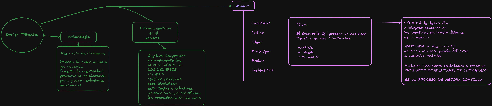
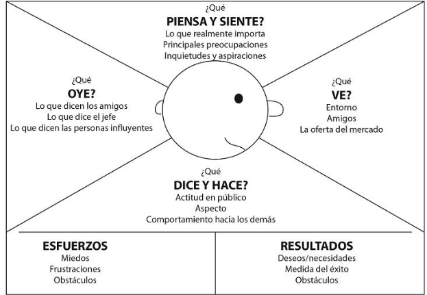

# Introducción a UX-UI 📖

## Temas

🙀 🙀

1.[Introducción a UX/UI](#introducción-a-experiencia-de-usuarios-ux)

- [X] ¿Qué es la experiencia de usuario? UX
- [ ] ¿Qué es la interfaz de usuario? UI

2.[Diseño centrado en el usuario](#design-thinking)

- [ ] Relación entre UX/UI
- [ ] rol de trabajo
- [ ] Experiencias diseñadas y accidentales.

3.[Metodologías de diseño y UXResearch](#ux-research)

- [ ] Metodologías de trabajo
- [ ] Metodologías de diseño (Design Thinking - Design Sprint)
- [ ] Investigación de experiencia de usuario

4.[Userpersona y benchmarking](#userpersona-y-benchmarking)

- [X] Usuário/Persona
- [X] Ficha de persona
- [X] Motivaciones y frustraciones
- [X] Mapa de empatía
- [ ] benchmarking de productos

5.Entrevistas cualitativas

- [ ] Entrevistas cualitativas a los usuarios.
- [ ] Preguntas abiertas y cerradas
- [ ] Cualitativo vs. cuantitativo

6.POV & MVP

- [ ] Producto mínimo viable
- [ ] Storyboarding y Storytelling
- [ ] Punto de vista

7.Arquitectura informacional

- [ ] Cardsorting
- [ ] Arquitectura de la información: agrupar, jerarquizar y etiquetar.

8.Userflows

- [ ] Diagrama de flujo: pantalla, decisión, interacción, inicio/fin y error
- [ ] Diagrama de tareas: entrada, acción y fin.

9.Protótipo (wireframe a mano)

- [ ] Instancias prototipo
- [ ] Calidad del prototipo
- [ ] Wireframes

10.Protótipo (wireframe digital) & Interface

- [ ] Tipos de aplicaciones (apps)
- [ ] Interfaces
- [ ] Wireframes digitais: Figma eAdobe XD básico

---

## Introducción a Experiencia de usuarios UX

Le experiencia de usuarios se refiera a la percepción general que tiene una persona al interactuar con un producto, servicio o sistema, en particular en el contexto del diseño y la usabilidad. La UX se centra en como se siente una persona al usar un producto, que tan fácil o difícil es para ellos realizar sus tareas, y como percibem el valor de producto en relación con sus necesidaes y expectativas.

Una buena experiencia de usuario implica que el producto o servicio es fácil de usar, eficiente, efectivo y, lo más importante, satisfactorio para el usuario. Esto incluye aspectos como la navegación intuititica, el diseño atractivi, la claridad en la presentación de la información, la respuesta rápida a las acciones del usuario y la ausencia de frustraciones y errores.

La experiencia de usuario se ve inlfuenciada por diversos factores, que van desde lo visual y la arquitectura de la información hasta el rendimiento del producto y la calidad del servicio al cliente. Es importante destacar que la experiencia de usuario no se limita únicamente a la interfaz de usuario, sino que abarca todos los aspectod de la interacción entre el usuario y el producto o servicio, incluidos los aspectos emocionales y psicológicos.

---

## Design Thinking

Es una metodología de resolución de problemas que prioriza la empatía hacia los usuarios, fomenta la creatividad y promueve la colaboración para generar soluciones innovadoras. Es un **enfoque centrado en el ser humano** que tiene como **objetivo** comprender profundamente las necesidades de los usuarios finales, redefinir problemas para identificar estrategias y soluciones alternativas y finalmente crear soluciones que satisfagan las necesidades de los usuarios.

Principales etapas involucradas en el proceso de pensamiento de
Design Thinking:

1- **Empatizar**: Comprender las necesidades y experiencias de los usuarios para quienes está diseñado. Esta etapa implica **observar, interactuar y empatizar** con las personas para comprender sus perspectivas.

2-**Definir**: Sintetizar la información recopilada durante la etapa de empatía para definir los problemas y desafíos centrales enfrentados por los usuarios. Esto implica enmarcar el problema de manera centrada en el ser humano y crear un enunciado del problema.

3-**Idear**: Generar una amplia gama de posibles soluciones al problema definido. Esta etapa fomenta la *creatividad* y el *pensamiento fuera de lo común* a menudo a través de sesiones de lluvia de ideas y otras técnicas de ideación.

4-**Prototipar**: Construir versiones aproximadas y de baja resolución de posibles soluciones. Estos prototipos pueden tomar diversas formas, como *bocetos, modelos físicos o simulaciones*. El objetivo es probar rápidamente y de manera económica las ideas para recopilar comentarios.

5-**Probar**: Recopilar comentarios de los usuarios mediante pruebas de los prototipos. *Esta etapa implica observar como interactúan los usuarios con los prototipos, recopilar comentarios e iterar en los diseños según las ideas obtenidas*.

6-**Implementar**: Una vez que una solución ha sido refinada y validada a través de pruebas, se implementa o se lanza al mundo real. Esta etapa puede implicar nuevas iteraciones y refinamientos basados en comentarios y evalaciones continuas.

> 💡Nota: **Las iteraciones** son ciclos repetitivos de revisión, ajuste y mejora en un proceso o producto.

 Son fundamentales porque:

1-**Perminten la mejora continua**: Cada iteración proporciona la oportunidad de mejorar el diseño, ya sea corrigiendo errores, optimizando funciones o agregando nuevas características.

2-**Facilitan la validación**:  Al probar prototipos y soluciones en etapas tempranas y luego iterar sobre ellos, se puede validar la viabilidad y eficacia de las ideas antes de invertir grandes cantidades de tiempo y recursos.

3-**Adaptabilidad**: Las iteraciones permiten adaptarse a cambios en los requisitos del proyecto, retroalimentación de los usuarios o nuevas ideas que surjan durante el proceso de diseño.

4-**Reducción de riesgos**: AL realizar múltiples iteraciones, se reducen los riesgos asociados con el desarrollo de un producto o servicio, ya que se abordan y resuelven problemas de manera incremental en lugar de esperar hasta el final del proceso.

---

## EL Doble Diamante

Es un modelo de proceso de diseño e innovación, que pueden seguir tanto diseñadores como no diseñadores para encontrar soluciones a problemas complejos que respondan a las necesidades de las personas. Se llama "doble diamante" porque consta de dos fases principales, cada una representada por un diamante, que a su vez se subdividen en cuatro etapas. Este modelo es utilizado en el **diseño Thinking y el desarrollo de productos y servicios**.

### **Fase 1: Descubrimiento(Diamond 1)**

1.1Explorar

En esta etapa, se busca comprender profundamente el problema de la situación en cuestión. Se realizan investigaciones, se recopila información y se exploran diferentes perspectivas para obtener una comprensión completa del contexto.

1.2Entender

Aquí se analizan y sintetizan los hallazgos obtenidos durante la fase de exploración. Se identifican patrones, tendencias y necesidades clave para definir claramente el problema y establecer objetivos específicos.

1.3Definir

En esta etapa, se refina la comprensión del problema y se define claramente el enfoque a seguir. Se establecen criterios de éxito y se generan ideas preliminares sobre posibles soluciones.

1.4Idear

Se generan una amplia gama de ideas y soluciones creativas para abordar el problema definido. Se fomenta la creatividad y la exploración de ideas innovadoras sin limitaciones.

### **Fase 2: Desarrollo(Diamond 2)**

2.1Prototipar

Se crean prototipos de las soluciones más prometedoras identificadas durante la fase de ideación. Estos prototipos pueden ser simples y de baja fidelidad, pero deben ser lo suficientemente robustos para probar y obtener retroalimentación.

2.2 Probar

Los prototipos desarrollados se someten a pruebas y evaluaciones con usuarios reales. Se recopila retroalimentación y se observa cómo interactúan los usuarios con las soluciones propuestas.

2.3 Refinar

Basado en los resultados de las pruebas y la retroalimentación recibida, se realizan ajustes y refinamientos a las soluciones. Se busca mejorar la efectividad, la usabilidad y la viabilidad de las soluciones antes de proceder a la implementación final.

2.4 Implementar

Finalmente, las soluciones refinadas se implementan y se llevan a la práctica en el mundo real. Se monitorea su desempeño y se realizan ajustes adicionales si es necesario.

El modelo del "Doble diamante" es una variante específica del enfoque design thinking. Aunque comparten similitudes y comparten el mismo principio de abordar problemas de manera estructurada y creativa, el "doble diamante" ofrece una descripción más detallada de las fases y etapas específicas del proceso.

[Temas](#temas)

---

### UX Research

Conceptos relacionados:

1.**Investigación de Usuarios**: Este proceso implica estudiar el comportamiento, necesidades y preferencias de los usuarios para informar el diseño de productos o servicios. Incluye métodos  cualitativos y cuantitativos para recopilar datos sobre  los  usuarios.

2.**Entrevistas De Usuarios**: Conversaciones uno a uno con usuarios para comprender sus objetivos, comportamientos y puntos de dolor.

3.**Encuestas**: Recopilación de datos cuantitativos de una muestra más grande de usuarios para identificar tendencias y preferencias.

4.**Pruebas de usabilidad**: Observación de usuarios mientras interactúan  con un prototipo o producto en vivo para identificar problemas de usabilidad y recopilar retroalimentación sobre la interfaz de usuario.

5.**Desarrollo de personas**: Creación de representaciones fictias de usuarios objetivo basadas en hallazgos  de investigación para comprender mejor sus necesidades y motivaciones.

6.**Mapeo de Experiencia del Usuario**: Visualización de la experiencia del usuario a lo largo de diferentes puntos de contacto para identificar puntos de dolor y oportunidades de mejora.

7.**Análisis competitivo**: Examinar productos de competidores para identificar fortalezas, debilidades y oportunidades de mejora.

8.**Análisis de Analíticas** Examinar datos cuantitativos de herramientas como Google Analytics para comprender como interactúan los usuarios con un producto o servicio.

**Puntos de dolor**: Los puntos de dolor(pain points), son las areas problemáticas o frustrantes que experimentan los usuarios al interactuar con un producto, servicio o proceso. Estos puntos de dolor representan obstáculos o dificultades que los usuarios encuentran es su experiencia.

Ejemplos:

1.**Dificultades en la navegación** Confusión al encontrar información o funciones dentro de un sitio web o aplicación.

2.**Procesos complicados**: Pasos excesivos o complicados en un proceso de compra, regristro o cualquier tarea.

3.**Rendmiento deficiente**: Lentitud, errores frecuentes o fallos técnicos en un producto o servicio.

4.**Falta de personalización**: Falta de opciones o capacidades para adaptar el producto o servicio a las necesidades específicas del usuario.

5.**Problemas de comunicación**: Falta de claridad en las instrucciones, mensajes o etiquetas que dificultan la comprensión o el uso adecuado del producto.

6.**Servicio al cliente deficiente**: Respuestas lentas, poco claras o poco útiles por parte del equipo de atención al cliente cuando se busca ayuda o asistencia.

Identificar y abordar los puntos de dolor es crucial para mejorar la experiencia del usuario y aumentar la satisfacción del cliente. Al comprender donde se encuentrar estos puntos de dolor, los diseñadores y empresas pueden implementar cambios y mejorar para hacer que el producto o servicio sea más fácil de usar y más atractivo para los usuarios.

Otros conceptos importantes de ux research

**Mapa de empatía**: Este es un artefacto visual que ayuda a los equipos de diseño a comprender mejor a los usuarios al representar sus pensamientos, sentimientos, acciones y necesidades. Al crear un mapa de empatía, los investigadores recopilan información sobre los usuatios mediante entrevistas, observaciones y métodos de investigación, y luego organizan estos datos en categorías clave como lo que piensan y sienten, lo que ven y oyen, lo que dicen y hacen, y sus necesidades y objetivos. Este mapa proporciona una comprensión más profunda y empática de los usuarios, lo que guía el proceso de diseño hacia soluciones que satisfacen realmente sus necesidades.

2.**Pruebas de Guerrilla**: Las pruebas de guerrilla son un método de investigación informal y rápido en el que los investigadores realizan pruebas de usabilidad con participantes no representativos en entornos no controlado, como cafeteróas, parques o espacios públicos. Estas pruebas son útiles para obtener retroalimentación rápida sobre un producto o diseño en desarrollo, pero no son cientificamente rigurosas. A menudo, los investigadores utilizan dispositivos móviles o prototipos de papel para realizar estas pruebas de manera rápida y efectiva.

3.**Entorno contextual**: Este método de investigación implica observar y comprender como los usuarios interactúan con un producto o servicio en su entorno natural, como su hogar, lugar trabajo o comunidad. Al estudiar a los usuarios en su entorno real, los investigadores pueden obtener información más auténtica sobre su comportamiento, necesidades y desafíos. Esto permite diseñar soluciones que se adapten mejor a las necesidades y contextos de los usuarios.

4.**Benchmarking**: El benchmarking implica comparar un producto, servicio o experiencia con los de la competencia o con las mejores prácticas de la industria para identificar áreas de mejora y oportunidades de diferenciación. Los investigadores realizan un análisis comparativo de características clave, rendimiento y experiencia del  usuario para evaluar como se posiciona un producto o servicio en relación con otros en el mercado. Esto ayuda a identificar fortalezas y debilidades, asi como oportunidades para mejorar y destacarse en el mercado.

5.**Arquetipos de Usuarios:**: Son reprensentaciones ficiticias de diferentes tipos de usuarios basados en datos de investigación. Estos arquetipos ayudan a los equipos de diseño a comprender mejor a su audiencia al personficar a los diferentes grupos de usuarios y sus características motivaciones y comportamientos únicos. Al diseñar para estos arquetipos, los equipos pueden crear experiencias más personalizadas y relevantes que satisfagan a las necesidades y expectativas de sus usuarios.

6.**Evaluación Heurística:**: La evaluación heurística es un método de evaluación de usabilidad en el que expertos revisan el producto o diseño según una lista de principios de diseño establecido, conocidos como Heurísticas. Estas herurísticas son pautas generales que se basan en principios de usabilidad y diseños de interacción. Durante esta evaluación, los expertos identidican problemas de usabilidad y áreas de mejora en el diseño, lo que ayuda a guiar las interacciones en el producto.

7.**Análisis de Tareas**: Implica un estudio detallado de las tareas que los usuarios realizan dentro un producto o servicio. Los investigadores descomponen actividades y flujos de trabajo de los usuarios para comprender mejor como interactúan con el producto. identificar puntos de fricción y oportunidades de mejora. Este análisis ayuda a optimizar la experiencia del usuario al garantizar que el prototipo satisfaga eficazmente las necesidaes y objetivos de los usuarios durante sus tareas y activididades.

8.**Diagrama de Afinidad**:Es una técnica de lluvia de ideas que implica organizar ideas, observaciones o hallazgos de investigación en grupos temáticos para identificar patrones tendencias emergentes. Los investigadores recopilan datos cualitativos durante el proceso de investigación, como notas de campo[^1], entrevistas o comentarios de los usuarios, y luego los agrupa en categorías similares. Este proceso ayuda a sintetizar grandes volúmenes de información y a identificar insighst clave que pueden informar el diseño y desarrollo del producto.

---

### UserPersona y Benchmarking

En el diseño UX/UI

- Es un **individuo ficitio** que se crea para **identificar un público específico**.
- Son **modelos** de personas que **representan a los usuarios** durante el proceso de diseño.
- Son **imaginarios** pero están creardos con mucho **detallismo y precisión**.
- **No están diseñadas únicamente según su información demográfica**.

Las personas son **arquetipos** basados en patrones de comportamientos revelados durante el proceso de investigación de usuarios.

¿Por qué necesitamos crear personas?

- Comprender lo que quieren los usuarios no es suficiente. Tienes que entender el contexto.
- Para diseñar una experiencia que deleite a los usuarios, debemos documentar sus pensamientos, sentimientos, expectativas y motivaciones.
- Las personas combinan estos conocimientos en **una narrativa que ayuda a tomar mejores decisiones y diseñar mejores productos**.

Proto persona

- Utilizaremos los datos recolectados de la investigación de usuarios, nuestras observaciones y suposiciones para crear una **Hipótesis**
- **La proto persona es una primera versión (sin validar)** de lo que luego va a ser la *User persona(validada)*
  Características
- Las proto personas son una **parte clave del diseño UX**. Nos aseguramos de hablar al público objetivo, construimos personas detalladas que reflejan los deseos, necesidades, expectativas y frustraciones de los usuarios.
- Cuando se habla de grupos de usuarios, segmentos de mercado y otros datos, puede ser fácil olvidar que **al final hay un ser humano**. Las personas son más que estadísticas. Son **narrativas** que van a inspirar y respaldar las decisiones que tomemos.
- Siempre que la compresión de todos los que formen parte del proceso de diseño sea clara, algo tan simple como el **nombre** de la persona disparará una amplia gama de datos: Datos demográficos, atributos, deseos, comportamientos, preocupaciones, miedos y citas:

**La proto persona debe tener:**

1-**Datos**: Nombre y apellido, profesión.

2-**Datos demográficos**: Lugar de residencia, edad, sexo, nivel de educación, estado civil, ingresos.

3-**Biografía**: Breve reseña de como es, como vive, que la define.

4-**Intereses**: Hobbies, modo de vida.

5-**Hábitos de consumo**: ¿Qué consume?, ¿Cómo lo hace y por qué?

6-**Objetivos, sueños, metas**: ¿Qué quieren hacer y por qué?

7-**Su relación con la tecnología**: ¿Qué usar?, ¿Con qué frecuencia?, ¿Para qué?

8- **frustraciones y motivaciones**: Qué se interpone en su camino?¿Qué los hace avanzar?

9- **Una frase que identifique lo mejor posible como piensa**: Se expresa entre comillas "quote"

### ¿Qué es un mapa de empatía?

Es un **esquema visual** con preguntas sobre el cliente objetivos ideal de un **producto o servicio determinado**.
Sirver **para entender mejor a este tipo de prototipo de persona** y por lo tanto poder satisfacer mejor sus necesidades y comunicarnos **empatizando** al máximo con ella.
Ayuda a reflexionar sobre como afectan el **entorno** y las **emociones** internas que vive.
Es importante tomarla como uno de los **puntos de partida para identificar como es este user persona**.

### ¿Qué piensa y siente?

- ¿Qué le da sentido a su vida?
- ¿Qué le preocupa?
- ¿Qué le hace feliz?
- ¿Qué otros pensamientos y sentimientos podrían motivar su comportamiento?

### ¿Qué ve?

- ¿Qué ve en el mercado?
- ¿Qué ve en su entorno inmediato?
- ¿Qué ve a otros diciendo y haciendo?
- ¿Qué está viendo y leyendo?

### ¿Qué escucha?

- ¿Qués está oyendo decir de los demás?
- ¿Qué está escuchando de sus amigos?
- ¿Qué está escuchando de su colegas?
- ¿Qué está escuchando de otros?

### ¿Qué dice y qué hace?

- ¿Qué le hemos oído decir?
- ¿Qué podemos imaginarle diciendo?
- ¿Cómo es su rutina?
- ¿Qué comportamiento hemos observado?
- ¿Qué podemos imaginarle haciendo?
- ¿Qué necesita hacer de manera diferente?
- ¿Qué trabajo(s)quiere o necesita conseguir?
- ¿Qué decisiones debe tomar?
- ¿Cómo sabemos qué tuvo éxito?

### ¿Qué lo motiva?

- ¿Cuales son sus deseos?
- ¿Cuáles son sus necesidades?
- ¿Qué espera qué suceda?
- ¿Cuáles son sus sueños?

### ¿Qué lo frustra?

- ¿Cuáles son sus miedos'
- ¿Cuáles son sus obstáculos?
- ¿Qué teme que suceda?
- ¿Cuáles son sus frustraciones?
- ¿Qué le causa ansiedad?
- ¿Qué le enoja?

para Gene 😍

[^1]: Notas de campo son registros escritos que los investigadores toman durante el proceso de investigación mientras están el campo, es decir, en el entorno donde ocurre el fenómeno que están estudiando.
